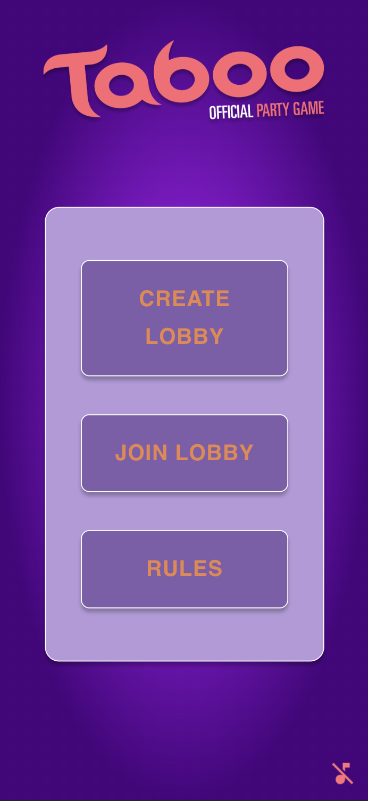
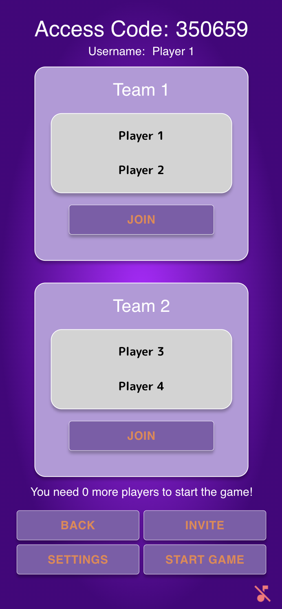
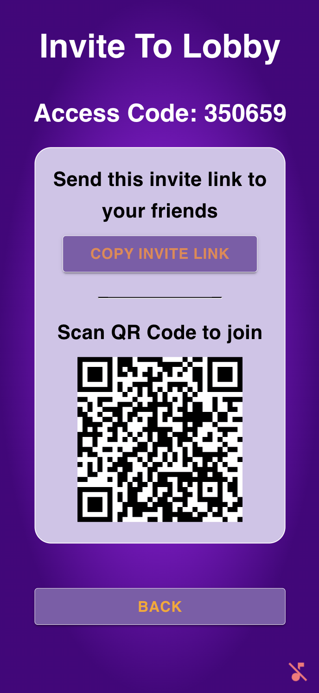
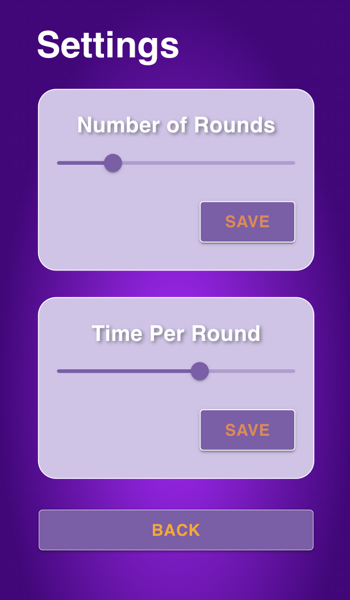
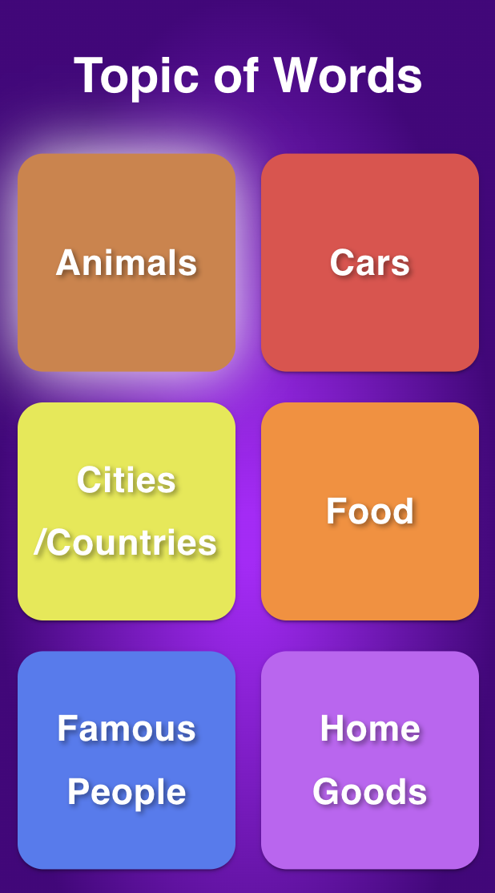
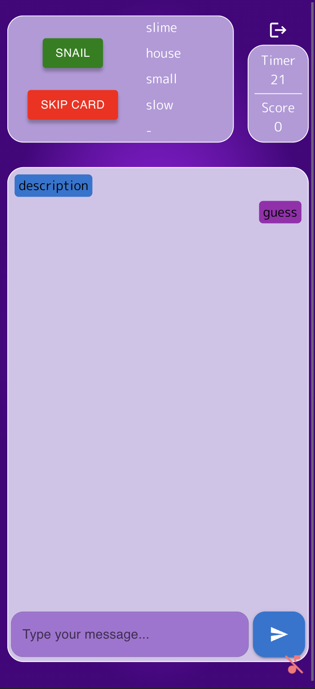
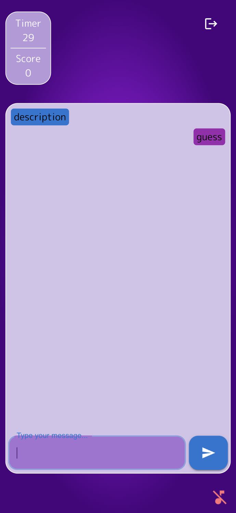
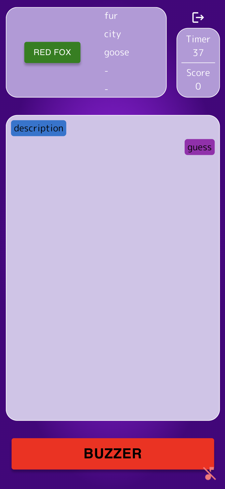
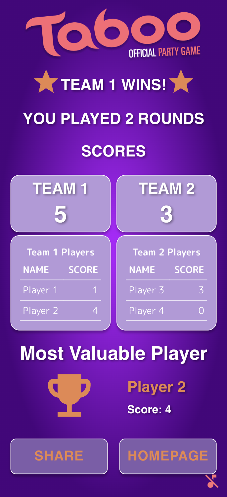

# Taboo
Unleash your word-guessing skills and experience the excitement of Taboo with this online version!

## Introduction
This project is an online version of the game Taboo. The objective of the game is for a designated "Clue-Giver" to describe a word without using five specified "taboo words",
while his team members attempt to guess the word correctly. The game consists of multiple rounds, which users can determine the number of. 
Each round consists of two turns. In one turn, a team acts as the guessing team, while in the other turn, they become the Buzzer Team. 
The Buzzer Team's responsibility is to watch for any accidental use of the taboo words by the Clue-Giver. 
At the end of all the rounds, the team with the most correctly guessed words is declared the winner.

The project aims to provide players with the flexibility to enjoy the game both remotely or in person. In the remote mode, players can utilize the chat and buzzer functionality. 
If the players want to play in-person, they can utilize this application for displaying the cards and keeping score.

Joining the game is convenient, with options to join remotely through an invite-link or access code, or to join in-person through a QR code. 
Additionally, user-friendly features, such as a dictionary API for word lookup and a share button to showcase achievements at the end of a game, enhance the overall experience of the application.

Let’s play Taboo!

## Getting Started
This guide helps you to install this client code on your local machine.

### Prerequisites
Before getting started, download the following:

1. For your local development environment, you will need to install [Node.js](https://nodejs.org/en).
2. Download the code of [this repository](https://github.com/sopra-fs23-group-05/Client).

### Installation
Follow these steps to install the client code on your local machine:

1. In your IDE, locate the option to import a project or open an existing project. E.g., in IntelliJ go to “File” > “New” > “Project from Existing Sources”.

2. Select the downloaded file of the client code.

3. Run the following command to install the project dependencies:

```
npm install
```

Once the dependencies are installed successfully, you can run the application locally using:

``` 
npm run dev 
```

Now you can open [http://localhost:3000](http://localhost:3000) to view the application in your browser. Make sure you have the [server](https://github.com/sopra-fs23-group-05/Server) running as well.

Notice that the page will reload if you make any edits.

### Deployment
To deploy the application, you need to build the project first. To do so, run the following command:

``` 
npm run build 
```   

See the section about [deployment](https://facebook.github.io/create-react-app/docs/deployment) for more information.

Then, you can push your changed code to this GitHub repository. The application will be automatically deployed to Heroku. To do so, run the following commands:

```
git add .
```

```
git commit -m "commit message"
```

```
git push origin main
```

### Testing
Testing is optional, and you can run the tests with `npm run test`.
This launches the test runner in an interactive watch mode. See the section about [running tests](https://facebook.github.io/create-react-app/docs/running-tests) for more information.

> For macOS user running into a 'fsevents' error: https://github.com/jest-community/vscode-jest/issues/423

## Technologies

* React with HTML/CSS and JS.
* [MUI](https://mui.com) for UI elements.
* [QR-Code API](https://www.npmjs.com/package/react-qr-code) to invite people.
* [Dictionary API](https://www.datamuse.com/api/) to get definitions of a word.
* [Twitter API](https://developer.twitter.com/en/docs/twitter-api) to share the result.
* [Taboo API](https://github.com/Kovah/Taboo-Data) to get the card data.
* Axios API to make API calls to our server.

## High-Level Components
The client application consists of several high-level components
* The [lobby page](https://github.com/sopra-fs23-group-05/Client/blob/main/src/components/views/LobbyPage.js) component is responsible for managing the overall lobby functionality. It serves as the main entry point for users, 
 providing them with essential lobby details such as the access code. On the lobby page, users can join a team and navigate to other pages, such as the [settings page](https://github.com/sopra-fs23-group-05/Client/blob/main/src/components/views/Settings.js) or the [invite page](https://github.com/sopra-fs23-group-05/Client/blob/main/src/components/views/Invite.js). 
 The lobby page also enables the lobby leader to initiate the game.
* The [settings page](https://github.com/sopra-fs23-group-05/Client/blob/main/src/components/views/Settings.js) component handles the configuration and customization of the game settings. 
 The lobby leader can view and modify various settings details, such as the number of rounds or the time allocated per round. Additionally, he can choose from multiple categories for the card deck.
* The [game page](https://github.com/sopra-fs23-group-05/Client/blob/main/src/components/views/Game.js) component is the core component responsible for managing the game itself.
 It displays crucial game details, including the current score and timer. Also, it presents the card with its taboo words and enables communication through the chat feature. Upon completion of a turn, the game page navigates the users to 
the [pregame page](https://github.com/sopra-fs23-group-05/Client/blob/main/src/components/views/PreGame.js) to prepare for the next turn. Once all rounds are played, the game page directs users to the [endscreen](https://github.com/sopra-fs23-group-05/Client/blob/main/src/components/views/Endscreen.js).
* The [endscreen](https://github.com/sopra-fs23-group-05/Client/blob/main/src/components/views/Endscreen.js) component provides users with a summary of the game's outcome. It displays the number of rounds played and showcases the final team scores, declaring the winner-team. 
 Additionally, the endscreen presents a ranking of player scores, highlighting the best player of the game. Players have the option to share the game results on Twitter.

## Illustrations

### Homepage
<div style="display: flex; align-items: center; gap: 10px;">
     
    <p style="max-width: 400px">
        Upon launching the game, you will be greeted by the homepage. Here, you have two options: to join an existing 
        lobby using a given access code or to create a new lobby. The lobby serves as a virtual room where players 
        gather to play the game.
    </p>
</div>

### Joining a Team
<div style="display: flex; align-items: center; gap: 10px;">
    
    <p style="max-width: 400px">
        When you joined the lobby, you will be able to select one of the two teams available.
    </p>
</div>


### Invite Friends
<div style="display: flex; align-items: center; gap: 10px;">
     
    <p style="max-width: 400px">
        To ensure a fun multiplayer experience, every user can navigate to the invite page.
        Here, you have the option to send an invite link or a QR code to your friends,
        allowing them to join the same lobby and participate in the game together.
    </p>
</div>


### Settings
<div style="display: flex; align-items: center; gap: 10px;">
     
     
    <p style="max-width: 400px">
        As the lobby leader, you hold the power to customize the game settings according to your preferences on the settings page.
        By utilizing the settings page, you can effortlessly personalize the game experience to suit your preferences.
        Experiment with different round counts, time limits, and topics to create an experience that aligns perfectly with your gaming style.
    </p>
</div>

### Gameplay
<div style="display: flex; align-items: center; gap: 10px;">
     
     
    
    <p style="max-width: 400px">
        Once the game begins, each player will have access to a chat interface.
        This interface enables communication between team members and enhances collaboration during gameplay.
        Additionally, if you are the clue-giver or a buzzer, you will also be able to see the word that needs to be guessed.
    </p>
</div>

### Endscreen
<div style="display: flex; align-items: center; gap: 10px;">
     
    <p style="max-width: 400px">
        At the end of the game, the endscreen displays the team with the highest score, indicating their victory.
        Furthermore, the end screen showcases the individual player who successfully guessed the most words throughout the game. 
        You also have the option to share the final results on Twitter.
    </p>
</div>

## Roadmap
Possible features that new developers can add:
* Optimize the application for different screen sizes.
* Feedback that shows if you are close to the word (if there is a spelling mistake etc.)
* Add multiple difficulties of cards (easy, medium, hard) and let the lobby leader choose the difficulty.

## Authors
* Daniel Maksimovic
* Felix Merz
* Melea Köhler
* Tom Meier

## License
This project is licensed under [MIT License](https://github.com/sopra-fs23-group-05/Client/blob/main/LICENSE).
